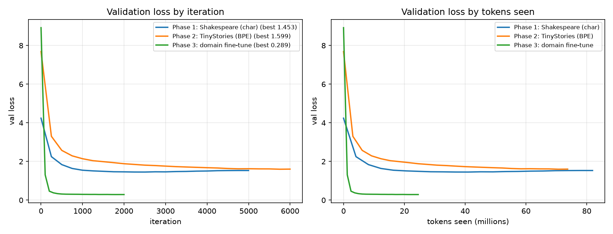
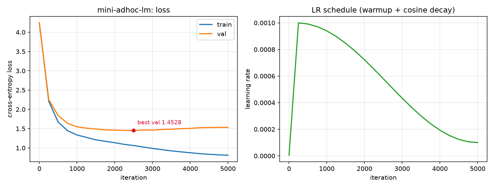
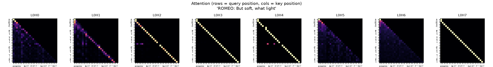

# AdHoc-GPT

A decoder-only transformer language model implemented from first principles in PyTorch, together with the full pipeline required to train, specialize, deploy and inspect it. The applied domain is multilateral drafting: resolutions, debate records and position papers.

The implementation deliberately avoids `torch.nn.MultiheadAttention`, `torch.nn.LayerNorm` and any external tokenizer library. Attention, normalization, activation, tokenization and the training loop are written directly and verified against reference implementations in the test suite.

---

## Summary of contributions

1. **Transformer implemented from first principles.** Causal multi-head self-attention, layer normalization, GELU, position-wise feed-forward blocks, weight tying and a key/value cache for generation. Correctness is established by unit tests against `torch.nn` equivalents and by a gradient-based check that no position attends to a later position.
2. **Byte-level BPE trained from scratch.** Merge learning maintains pair statistics incrementally rather than recounting the corpus at every step, reducing 768 merges over 1.1M characters from approximately six minutes to 1.1 seconds. The result is validated against a naive reference implementation.
3. **A complete training stack.** Mixed-precision training, gradient accumulation, cosine learning-rate decay with warmup, gradient clipping, checkpointing and resumption, memory-mapped datasets, distributed data-parallel training via `torchrun`, and throughput instrumentation reporting milliseconds per iteration, tokens per second, model-flops utilization and peak memory.
4. **Trained models with published curves.** A 7.5M-parameter model attains 1.4528 validation cross-entropy on character-level Shakespeare; an 8.1M-parameter model with a 2048-token BPE vocabulary attains 1.5990 on a TinyStories subset.
5. **Domain specialization by fine-tuning.** A synthetic corpus of multilateral documents is generated from clause grammars, and a pretrained checkpoint is adapted to it under a shared vocabulary.
6. **Retrieval-augmented generation implemented from scratch.** Okapi BM25, dense retrieval over the model's own token embeddings, reciprocal-rank fusion, maximal marginal relevance for redundancy reduction, and context-budgeted prompt assembly.
7. **Reproducibility.** A single script reproduces every phase: `bash scripts/reproduce_all.sh`. The test suite contains 58 tests.

---

## Project phases

| Phase | Scope | Implementation |
|---|---|---|
| 1. Core model | tokenizers, embeddings, causal attention, feed-forward, training loop, sampling | `tokenizer.py`, `model.py`, `train.py`, `generate.py` |
| 2. Scaling and engineering | BPE vocabulary, larger corpora, mixed precision, gradient accumulation, `torch.compile`, distributed training, benchmarking | `data.py`, `train.py`, `bench.py` |
| 3. Domain specialization | synthetic corpus generation and fine-tuning from a pretrained checkpoint | `domain/corpus.py`, `train.py --init-from` |
| 4. Application and retrieval | BM25 and dense retrieval over a clause library, drafting interface and web service | `rag.py`, `app.py` |
| 5. Visualization | attention maps, per-token loss, embedding projection, run comparison | `viz.py`, `plots.py` |

**Note on the domain corpus.** The diplomatic corpus is synthetic and templated, generated within this repository from clause grammars. The specialized model reproduces the register of multilateral drafting; it does not reproduce authentic documents, and generated text should not be read as the position of any State or organ. See [MODEL_CARD.md](MODEL_CARD.md).

---

## Installation and use

```bash
python -m venv .venv && source .venv/bin/activate
pip install -r requirements.txt

# Phase 1
python -m adhoc_gpt.data  --dataset shakespeare --tokenizer char --out-dir data/shakespeare_char
python -m adhoc_gpt.train --preset mini --data-dir data/shakespeare_char --out-dir runs/mini-adhoc-lm
python -m adhoc_gpt.generate --ckpt runs/mini-adhoc-lm/ckpt.pt --prompt "KING RICHARD III:"

# All phases end to end (approximately one hour on a single 8 GB GPU)
bash scripts/reproduce_all.sh
```

Without a GPU, `--device cpu --preset nano --max-iters 500` trains a small model in a few minutes.

---

## Results

All results were produced by the code in this repository on a single RTX 4070 Laptop GPU (8 GB) using bfloat16 mixed precision.

| Run | Parameters | Corpus | Tokens seen | Best validation loss | Wall clock |
|---|---|---|---|---|---|
| Mini-AdHoc-LM (Phase 1) | 7.48M | tiny-Shakespeare, character vocabulary of 65 | 82M | 1.4528 | 28.9 min |
| Mini-TinyStories (Phase 2) | 8.11M | TinyStories, 53.6M characters, BPE vocabulary of 2048 | 74M | 1.5990 | 23.9 min |
| AdHoc-LM-Domain (Phase 3) | 8.11M | synthetic diplomatic corpus, fine-tuned from Phase 2 | 25M | 0.2892 | 8.8 min |

Losses are cross-entropy per token and are not comparable across rows, since the tokenizers differ in how much information a single token carries. For reference, the character-level Shakespeare configuration of nanoGPT reports approximately 1.47 validation loss; the from-scratch implementation here reaches 1.4528 at 7.5M parameters. The much lower Phase 3 loss reflects the predictability of a templated corpus rather than a stronger model: fine-tuning reduced validation loss from 8.94 to 1.31 within 100 iterations.



### Throughput

Measured with `adhoc_gpt.bench` on the same GPU, with explicit CUDA synchronisation around the timed region.

| Configuration | Parameters | ms/iteration | tokens/s | MFU | Peak memory |
|---|---|---|---|---|---|
| `mini`, fused attention, batch 48 | 7.48M | 173.7 | 70,746 | 10.3% | 2.53 GB |
| `mini`, explicit attention, batch 48 | 7.48M | 243.6 | 50,436 | 7.3% | 3.37 GB |
| `nano`, batch 16 | 1.07M | 10.0 | 203,965 | 4.2% | 0.18 GB |
| `mini`, batch 16 | 8.11M | 53.9 | 75,992 | 11.9% | 1.01 GB |
| `small`, batch 16 | 26.49M | 276.9 | 29,583 | 15.6% | 3.84 GB |

The fused kernel is 1.40 times faster than the explicit implementation and uses 0.84 GB less memory, while producing numerically equivalent outputs (verified in the test suite). The `base` preset exceeds 8 GB at batch 16 and is reported as out of memory by the sweep rather than being silently skipped.

### Training curves



Validation loss reaches its minimum at iteration 2500 and increases thereafter while training loss continues to fall, the expected overfitting behaviour for a 7.5M-parameter model on a corpus of 1.1M characters. Checkpoint selection uses the validation minimum rather than the final iterate.

### Sample output, Mini-AdHoc-LM, prompt `KING RICHARD III:`

```
KING RICHARD III:
And will take it as good as to do thee most her.
A bar to the sigh from here and do I.
O God, let's awhile; I am a crown, and enter,
That love o' the steeds that break it will be dead!
O, what will this at looks may scorn thee,
Or who in the head of deserve, which we would
Have in the second heart, being against my honour
Is lawful back.
```

Trained from random initialization on 1.1M characters, the model has acquired speaker headings, blank-verse line length, punctuation conventions and Early Modern morphology, without semantic coherence. This is the expected capability at this scale.

### Attention structure, layer 0, all eight heads



Every attention map is strictly lower-triangular, confirming that the causal mask prevents any position from attending to its successors. The heads have differentiated: head 3 approximates an identity mapping, head 1 attends to the immediately preceding token, head 6 distributes attention broadly over the history, and heads 0 and 5 anchor on the start of the sequence.

---

## Phase 1: model architecture

Decoder-only transformer with pre-normalization residual blocks:

```
tokens -> token embedding + positional embedding -> dropout
       -> [ x + CausalSelfAttention(LayerNorm(x))
            x + MLP(LayerNorm(x))              ] x n_layer
       -> LayerNorm -> lm_head (tied to the token embedding) -> logits
```

| Component | Location | Notes |
|---|---|---|
| Character tokenizer | `tokenizer.py` | one identifier per distinct character (65 for Shakespeare) |
| Byte-level BPE | `tokenizer.py` | merge table learned from pair counts, regular-expression pre-segmentation, byte-level fallback so that arbitrary Unicode round-trips |
| Token and positional embeddings | `model.py` | learned; output projection tied to the token embedding |
| Multi-head self-attention | `CausalSelfAttention` | fused query/key/value projection; `softmax(QKᵀ/√d + causal mask)V` computed explicitly. `--no-flash` selects the explicit path; the default uses the numerically equivalent fused kernel |
| Causal masking | `CausalSelfAttention.mask` | lower-triangular buffer, offset-aware so that it remains correct under key/value caching |
| Feed-forward network | `MLP` | C → 4C → GELU → C |
| Layer normalization, GELU | `LayerNorm`, `gelu` | implemented directly; unit-tested against `torch.nn` equivalents |
| Key/value cache | `AdHocGPT.generate` | reduces per-token generation cost from O(T²) to O(T) |
| Sampling | `generate.py` | temperature, top-k, nucleus (top-p), seeded |

Model configurations defined in `config.py`:

| Preset | Layers | Heads | Embedding | Context | Parameters (vocabulary 65) |
|---|---|---|---|---|---|
| `nano` | 4 | 4 | 128 | 128 | 0.8M |
| `mini` | 6 | 8 | 320 | 256 | 7.5M |
| `small` | 8 | 8 | 512 | 512 | 25M |
| `base` | 12 | 12 | 768 | 1024 | 86M |

---

## Phase 2: scaling and engineering

```bash
python -m adhoc_gpt.bench --preset mini --sweep attention   # explicit vs fused attention
python -m adhoc_gpt.bench --sweep presets --batch-size 32   # ms/iter, tokens/s, MFU, peak memory
python -m adhoc_gpt.bench --sweep batch --preset small      # largest batch that fits

# A BPE vocabulary shared by the pretraining and fine-tuning corpora
python -m adhoc_gpt.data --train-tokenizer tinystories data/raw/diplomacy.txt \
    --tokenizer bpe --vocab-size 2048 --out-dir data/shared_vocab
python -m adhoc_gpt.data --dataset tinystories --max-docs 60000 \
    --tokenizer-from data/shared_vocab/tokenizer.json --out-dir data/tinystories_bpe

# Distributed data-parallel training
torchrun --standalone --nproc_per_node=4 -m adhoc_gpt.train --preset small \
    --data-dir data/tinystories_bpe --grad-accum-steps 8
```

Throughput measurement synchronizes the CUDA stream before timing; without this, the timer records kernel-launch overhead rather than compute and reports utilization figures above 100%.

---

## Phase 3: domain specialization

`domain/corpus.py` generates resolutions, verbatim debate records, position papers and procedural records across eight topics. Clauses are typed by the complement each verb governs (noun phrase, object plus infinitive, that-clause, bare infinitive), so an operative verb is never combined with a phrase it cannot take:

```
The General Assembly,

Recalling its previous resolutions on climate resilience, in particular resolution A/RES/77/214,

Concerned that the widening adaptation finance gap continues to undermine the objectives of
the Paris Agreement,

1. Urges Member States to allocate predictable and additional resources for national adaptation plans;
2. Decides to establish a voluntary trust fund in support of early warning systems.
```

Fine-tuning takes the architecture and vocabulary from the base checkpoint and rejects a vocabulary mismatch:

```bash
python -m adhoc_gpt.data --dataset data/raw/diplomacy.txt \
    --tokenizer-from data/shared_vocab/tokenizer.json --out-dir data/diplomacy_bpe
python -m adhoc_gpt.train --data-dir data/diplomacy_bpe --out-dir runs/adhoc-lm-domain \
    --init-from runs/mini-tinystories/ckpt.pt --lr 2e-4 --max-iters 2000
```

---

## Phase 4: retrieval-augmented drafting

Retrieval is implemented without an external search dependency:

- **BM25** (`rag.py`): Okapi term weighting over a clause library derived from the corpus.
- **Dense retrieval**: document vectors formed as mean token embeddings taken from the trained model itself, scored by cosine similarity.
- **Hybrid retrieval**: reciprocal-rank fusion of both rankings, followed by maximal marginal relevance so that the retrieved clauses are distinct rather than paraphrases of one another.
- **Prompt assembly**: precedent is dropped until the assembled prompt fits within the model's context window, and the interface reports only the clauses the model actually received.

```bash
python -m adhoc_gpt.rag --build --corpus data/raw/diplomacy.txt --library data/clause_library.json
python -m adhoc_gpt.app draft --topic "maritime security" --tokens 400
python -m adhoc_gpt.app repl                  # interactive drafting
python -m adhoc_gpt.app serve --port 8000     # web interface, standard library only
```

Retrieved clauses are formatted into a document header matching the corpus, so that the fine-tuned model continues the document rather than describing it. Generated output carries a disclaimer identifying it as synthetic.

The prompt format is load-bearing, and getting it wrong is informative. Presenting precedent under a heading that does not occur in the corpus caused the model to emit a document separator immediately and write nothing; omitting the `Session` and `Document` fields caused it to supply those fields itself and then re-declare the topic, returning a resolution on an unrelated subject. The prompt therefore reproduces the corpus schema exactly, and generation suppresses the separator token. Both behaviours are covered by regression tests.

Output of `python -m adhoc_gpt.app draft --topic "maritime security"`, abbreviated:

```
The General Assembly,

Recalling the contribution of joint patrol arrangements to the protection of seafarers and
their representatives,

Mindful of the United Nations Convention on the Law of the Sea and the obligations arising
therefrom,

Noting that durable solutions to piracy in transit corridors require sustained international
cooperation,

1. Notes that capacity-building for prosecution and transfer agreements should be
   demand-driven and sustained;

2. Further decides to include in the provisional agenda of its seventy-sixth session an item
   entitled "maritime security";

4. Invites all States to strengthen joint patrol arrangements in accordance with regional
   information-sharing arrangements;
```

The retrieved precedent is visible in the output: joint patrol arrangements and the Convention on the Law of the Sea both entered through retrieval. Clause repetition across operative paragraphs remains a limitation at this scale.

---

## Phase 5: visualization

```bash
python -m adhoc_gpt.viz attention  --ckpt runs/mini-adhoc-lm/ckpt.pt --text "ROMEO: But soft,"
python -m adhoc_gpt.viz token-loss --ckpt runs/adhoc-lm-domain/ckpt.pt --text "Recalling its ..."
python -m adhoc_gpt.viz embeddings --ckpt runs/mini-adhoc-lm/ckpt.pt
python -m adhoc_gpt.viz compare    --runs runs/mini-adhoc-lm runs/mini-tinystories
python -m adhoc_gpt.plots --run runs/mini-adhoc-lm
```

---

## Testing

```bash
pytest
```

The suite comprises 58 tests covering: parity of the layer normalization and GELU implementations with `torch.nn`; absence of information flow from future positions, established by gradient inspection; agreement between the explicit and fused attention paths; equivalence of cached and uncached forward passes; tokenizer round-trips including Unicode and special tokens; agreement of the incremental BPE trainer with a naive recount; the learning-rate schedule; next-token alignment of training batches; end-to-end training that must reduce the loss; fine-tuning from a checkpoint and rejection of vocabulary mismatch; type alignment of the clause grammars; BM25 ranking, filtering and redundancy reduction; the HTTP drafting interface; and every plotting routine.

If the shell defines a system `PYTHONPATH` (for example under ROS), invoke the suite as `env -u PYTHONPATH pytest`.

---

## Repository layout

```
adhoc_gpt/
  config.py         model and training configuration, presets
  tokenizer.py      character-level and byte-level BPE tokenizers
  data.py           corpus acquisition, shared-vocabulary training, tokenization, batching
  model.py          LayerNorm, GELU, CausalSelfAttention, MLP, Block, AdHocGPT
  train.py          training loop: mixed precision, cosine schedule, DDP, fine-tuning
  generate.py       sampling interface
  bench.py          throughput, utilization and memory benchmarks
  rag.py            BM25 and dense retrieval, clause library, MMR, prompt assembly
  app.py            drafting application: draft, retrieve, repl, serve
  viz.py            attention maps, per-token loss, embedding projection, run comparison
  plots.py          training curves
  domain/corpus.py  synthetic diplomatic corpus generator
scripts/            reproduce_phase1.sh, reproduce_all.sh
tests/              unit and end-to-end tests
runs/               metrics, curves, samples (weights are not tracked)
```

---

## Status

All five phases are implemented, trained and documented. Known limitations: the domain corpus is synthetic, so the specialized model learns the form of multilateral drafting rather than its substance; operative paragraphs repeat within a draft; and the 256-token context restricts how much retrieved precedent can be supplied. Subsequent work: non-synthetic domain corpora, instruction tuning, longer context, and preference-based ranking of alternative drafts.

---

## References

- S. Raschka, *Build a Large Language Model (From Scratch)*.
- A. Karpathy, nanoGPT and minBPE, for the tiny-Shakespeare corpus and the structure of the training loop.
- R. Eldan and Y. Li, *TinyStories*, used as the Phase 2 pretraining corpus.
- S. Robertson and H. Zaragoza, *The Probabilistic Relevance Framework: BM25 and Beyond*.
- J. Carbonell and J. Goldstein, *The Use of MMR, Diversity-Based Reranking for Reordering Documents*.
